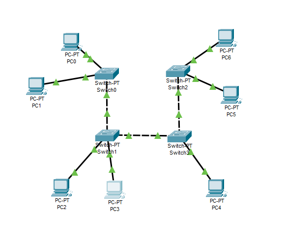
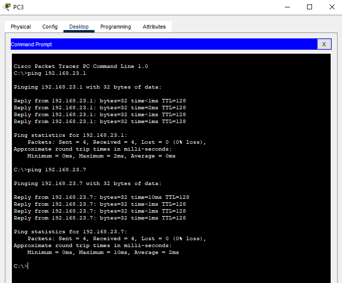
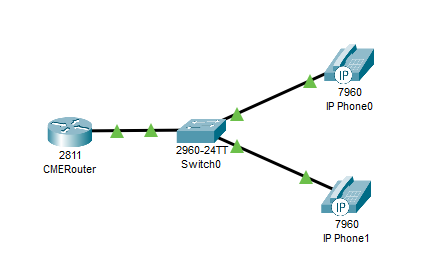
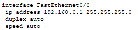
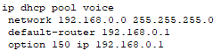
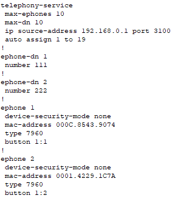
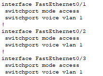
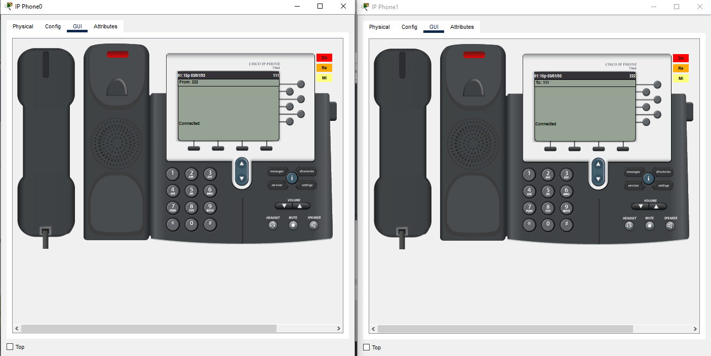
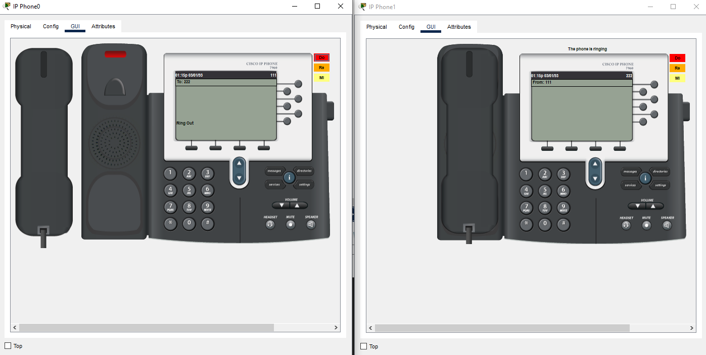

University: [ITMO University](https://itmo.ru/ru/) \
Faculty: [FICT](https://fict.itmo.ru) \
Course: [IP-telephony](https://github.com/itmo-ict-faculty/ip-telephony) \
Year: 2023/2024 \
Group: K4212 \
Author: Potitova Valentina Alexandrovna \
Lab: Lab1 \
Date of create: 07.02.2024 \
Date of finished: 13.02.2024

# Лабораторная работа №1 "Базовая настройка ip-телефонов в среде Сisco packet tracer"

## Цель работы
Изучить рабочую среду Cisco Packet Tracer, ознакомиться с интерфейсами основных устройств, типами кабелей, научиться собирать топологию. Изучить построение сети IP-телефонии с помощью маршрутизатора, коммутатора и IP телефонов Cisco 7960 в среде Packet tracer.

## Ход работы

### Часть 1
Собрали схему соединения. Настроили для ПК статические IP-адреса: 192.168.23.1 - 192.168.23.7/24.

Проверили связанность устройств, пинги проходят.

### Часть 2
Собрали схему соединения и изменили имя маршрутизатора на CMERouter:

Перешли к настройкам маршрутизатора. \
Настроили интерфейс fa0/0: \

Настроили DHCP сервера для передачи голоса и данных: \

Настроили услуги телефонии и IP-телефоны, присвоили им номера: \

Создали VLAN порты на коммутаторе для взаимодействия коммутатора с маршрутизатором и подключили IP телефоны.

Проверили звонки между телефонами:

 \

## Вывод
В ходе выполнения лабораторной работы мы изучили рабочую среду Cisco Packet Tracer, ознакомились с интерфейсами основных устройств, типами кабелей, научились собирать топологию. Изучили построение сети IP-телефонии с помощью маршрутизатора, коммутатора и IP телефонов Cisco 7960 в среде Packet tracer.
