University: [ITMO University](https://itmo.ru/ru/) \
Faculty: [FICT](https://fict.itmo.ru) \
Course: [IP-telephony](https://github.com/itmo-ict-faculty/ip-telephony) \
Year: 2023/2024 \
Group: K4212 \
Author: Potitova Valentina Alexandrovna \
Lab: Lab2 \
Date of create: 14.02.2024 \
Date of finished: 20.02.2024

# Лабораторная работа №2 "Конфигурация voip в среде Сisco packet tracer"

## Цель работы
Изучить построение сети IP-телефонии с помощью маршрутизатора Cisco 2811, коммутатора Cisco catalyst 3560 и IP телефонов Cisco 7960.

## Ход работы

### Часть 1

Построена топология сети: \
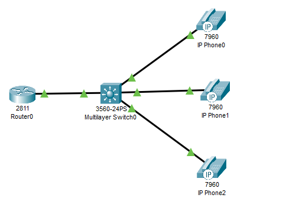

Изменили название роутера на CMERouter в конфигурационном режиме. \
Отключили синтаксис ввода слов от DNS серверов и задали пароли для защиты маршрутизатора: \

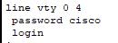

Настроили интерфейс fa0/0 на маршрутизаторе: \
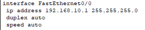

Настроили DHCP сервера для передачи голоса и данных на маршрутизаторе: \
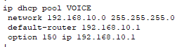

Настроили услуги телефонии на маршрутизаторе, настроили IP-телефоны: \
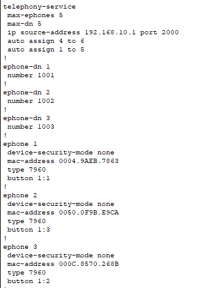

Создали VLAN-порты на коммутаторе и подключили IP телефоны: \
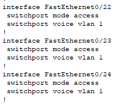

Проверили звонки между телефонами и перехват звонка: \
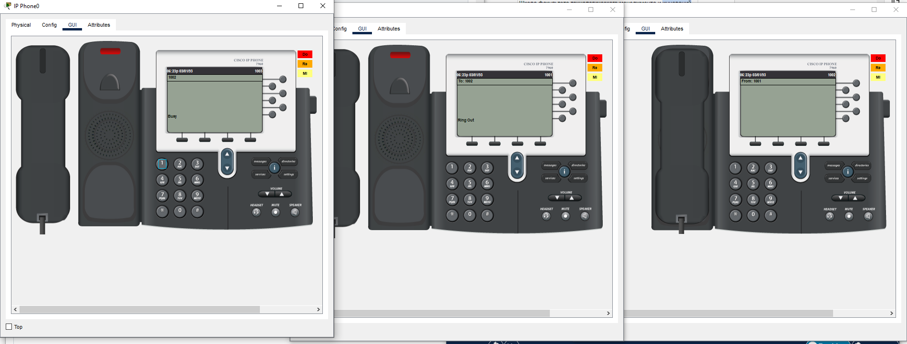
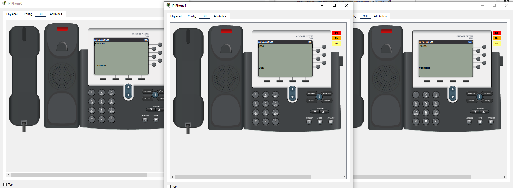

### Часть 2
Собрали новую топологию сети: \
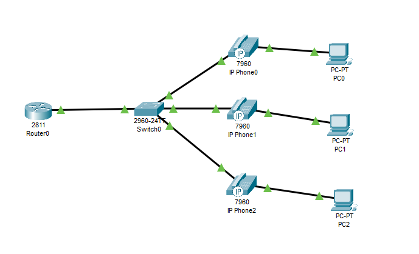

Создали VLAN-порты на коммутаторе и подключили IP телефоны, задали маршрут по умолчанию: \
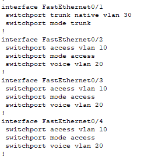 \
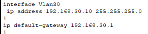

Настроили DHCP сервера для передачи голоса и данных на маршрутизаторе: \
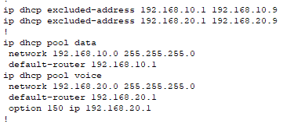

Создали логические подынтерфейсы для vlan 10, vlan 20 и vlan 30: \
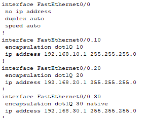

Настроили услуги телефонии и IP-телефоны: \
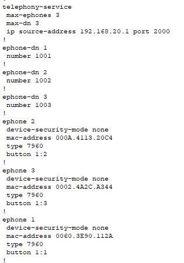

Подключили конечные узлы устройств. \
Проверили связанность и звонки между телефонами: \
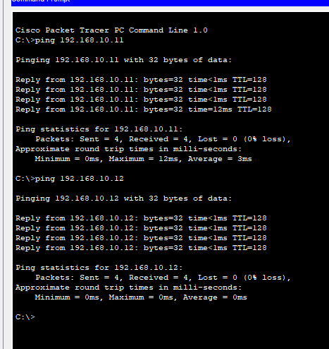 \
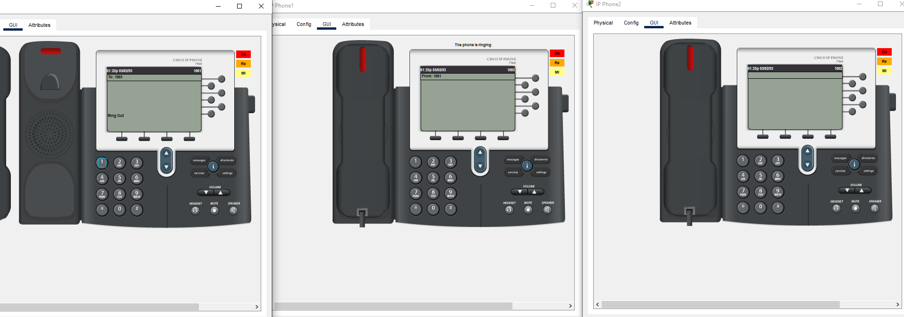

## Вывод
В ходе выполнения лабораторной работы мы изучили построение сети IP-телефонии с помощью маршрутизатора Cisco 2811, коммутатора Cisco catalyst 3560 и IP телефонов Cisco 7960.