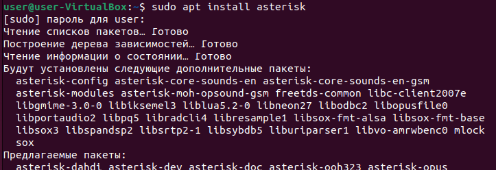
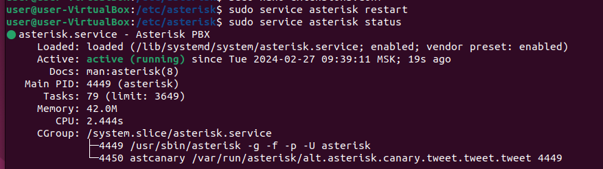
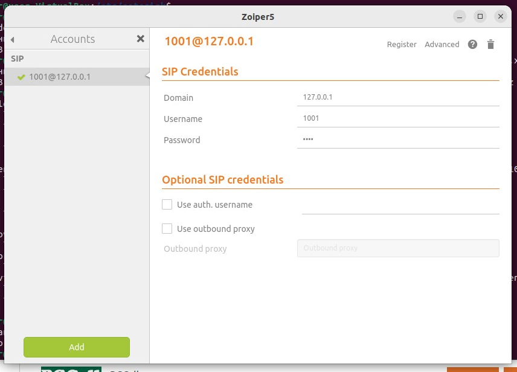
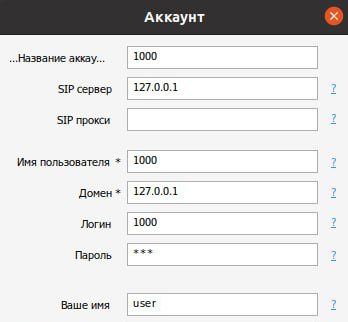
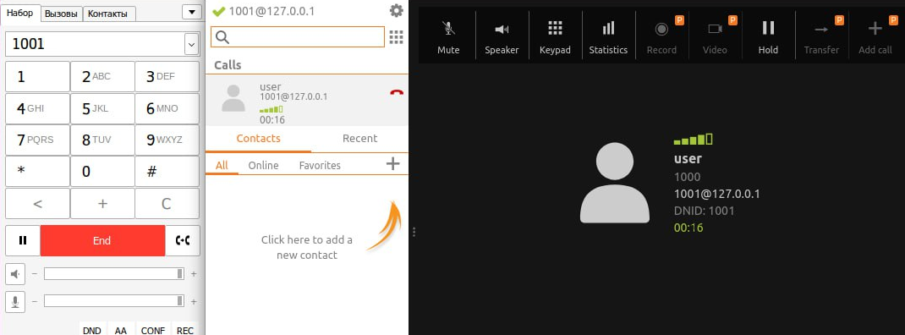

University: [ITMO University](https://itmo.ru/ru/) \
Faculty: [FICT](https://fict.itmo.ru) \
Course: [IP-telephony](https://github.com/itmo-ict-faculty/ip-telephony) \
Year: 2023/2024 \
Group: K4212 \
Author: Potitova Valentina Alexandrovna \
Lab: Lab3 \
Date of create: 27.02.2024 \
Date of finished: 27.02.2024

# Лабораторная работа №3 " Использование Asterisk в качестве SIP proxy"

## Цель работы
Изучить программный комплекс Asterisk. Настройка Asterisk для локальных звонков.

## Ход работы

### Часть 1

Установили Asterisk на Ubuntu. \


В файле sip.conf добавили информацию о номерах телефонов 1000 и 1001:
```
[1000]
type=friend
host=dynamic
secret=123
context=ext_1000

[1001]
type=friend
host=dynamic
secret=123
context=ext_1001
```

Также добавили информацию в файл extensions.conf:
```
[ext_1000]
exten => _XXXX,1,Dial(SIP/${EXTEN})

[ext_1001]
exten => _XXXX,1,Dial(SIP/${EXTEN})
```
Перезапустили Asterisk, чтобы изменения вступили в силу и проверили статус: \


Далее установили Zoiper5, произвели соответствующие настройки: \


Установили и настроили MicroSIP, предварительно установив wine: \


Проверили соединение: \


## Вывод
В ходе выполнения лабораторной работы мы изучили программный комплекс Asterisk и сделали настройку Asterisk для локальных звонков.
